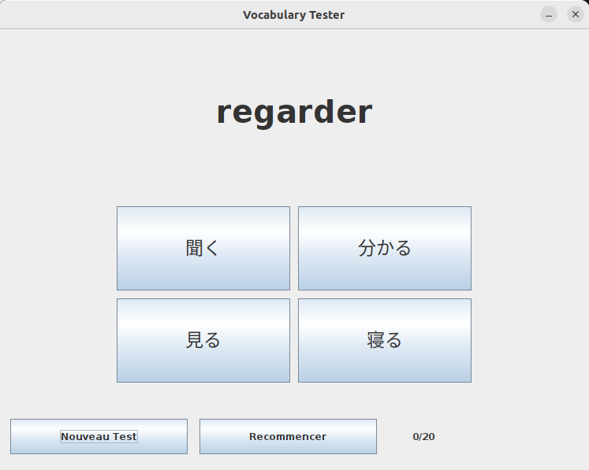

# Vocabulary Tester

Vocabulary Tester est un programme permettant la conception de questionnaire personnalisé dans le but d'apprendre du vocabulaire.

## Execution

Ce jeu utilise l'environnement Java.

```bash
#Compiler
javac -sourcepath src -d bin src/Main.java 

#Générer le jar
jar cfe VocabularyTest.jar Main -C bin ./

#Lancer le projet
java -jar VocabularyTest.jar 
```

## Le Jeu

Le questionnaire ce présente comme-ci. Un mot est questionné dans une langue, le joueur doit choisir parmi l'une des réponses toutes écrites dans la langue opposée. 

Pour lancer une partie, le joueur selectionne **un fichier questionnaire** (.txt), il choisit le nombre de question à générer, puis le mode de jeu (c'est-à-dire si les langues sont alternées entre les questions ou non).

Durant la partie, lorsque le joueur clique sur une bonne réponse il récolte un point, ce qui permet d'évaluer son niveau à la fin du jeu.



## Personnalisation - Fichier Questionnaire

L'utilisateur peut personnaliser son questionnaire comme bon lui semble à partir d'un fichier texte à importer. La syntaxe est la suivante : 

```
Hello#Bonjour
Goodbye#Au revoir
Yes#Oui
No#Non
Please#S'il vous plaît
```

D'un côté nous trouvons les mots dans une langue A, et de l'autre leurs équivalents dans une langue B. Les mots sont séparés d'un **#** afin de permettre les espaces ou parenthèse.

